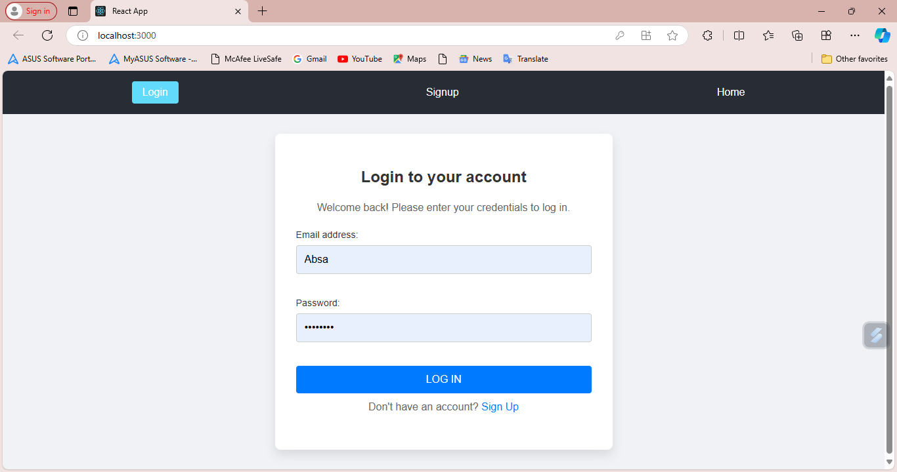
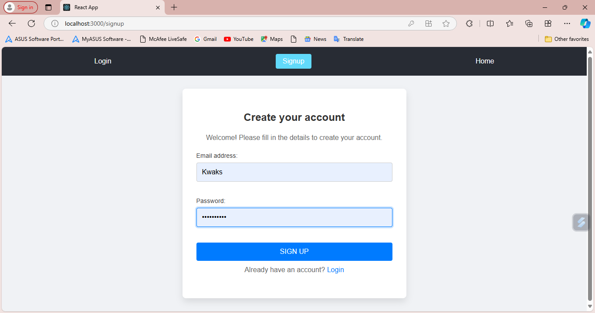
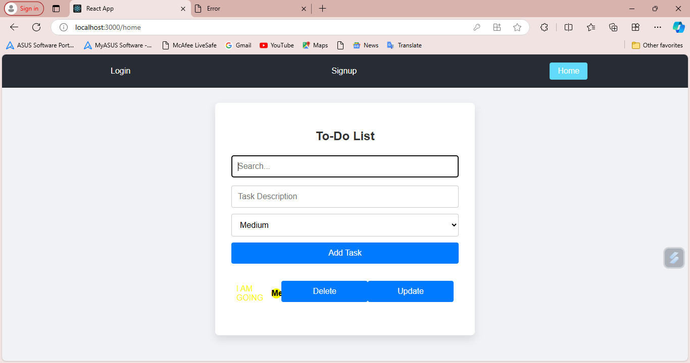

# To-Do List Application

This is a responsive, user-friendly To-Do List Application that includes login, registration, and CRUD (Create, Read, Update, Delete) operations for managing to-do list items. The application implements user authentication and authorization to ensure user data is protected.

## Features

### 1. Pages
- **Login Page**: Users can log in with their registered credentials.
- **Registration Page**: New users can register with the following details:
  - Username
  - Password
- **Home Page**: The home page displays the to-do list for the logged-in user.

### 2. To-Do List Functionalities
- **Search Function**: Users can search for to-do items by keyword.
- **Add Function**: Users can add new to-do items with the following details:
  - Task Description
  - Priority (High, Medium, Low)
- **Delete Function**: Users can delete existing items from their to-do list.
- **Update Function**: Users can edit existing items in their to-do list.
- **Priority Colors**: The priority of each item is visually represented by colors:
  - Red: High priority
  - Yellow: Medium priority
  - Green: Low priority

### 3. General Requirements
- The app supports **CRUD operations** for to-do list items.
- **Responsive design** ensures the app works on different devices and screen sizes.
- Proper **input validation** is implemented to prevent errors during form submissions.
- **User authentication and authorization** is implemented to protect user data.

## Screenshots

Here are the paths to the screenshots for each page of the application:

1. **Login Page**
   

2. **Registration Page**
   

3. **Home Page (To-Do List)**
   

## Technologies Used

- **Frontend**: React.js
- **Backend**:  Server (for managing mock data)
- **CSS**: For styling and ensuring responsiveness
- **Axios**: For making HTTP requests to interact with the backend
- **React Router DOM**: For handling navigation between pages
- **Redux**: For managing application state (if applicable)
- **LocalStorage**: To store user session data

## Installation and Setup

To run this project locally:

1.  repository:
   ```bash
   git clone https://github.com/Siphe23/Todo-list.git
